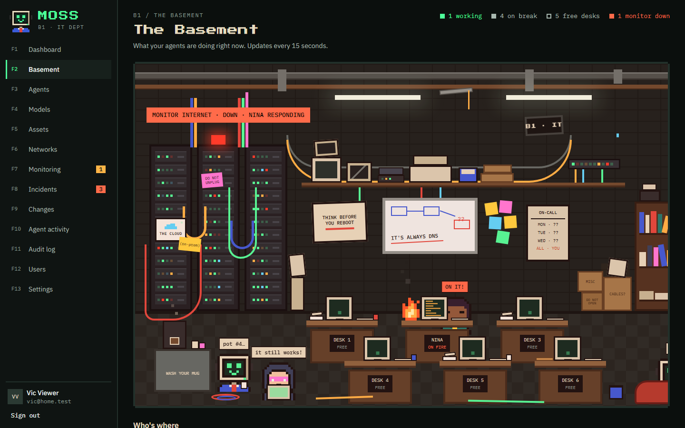
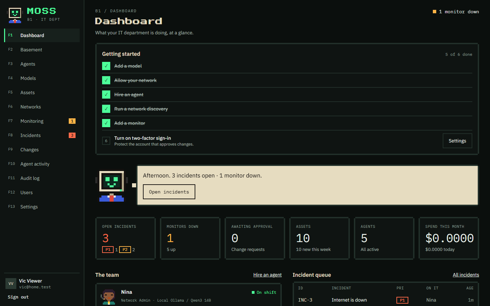
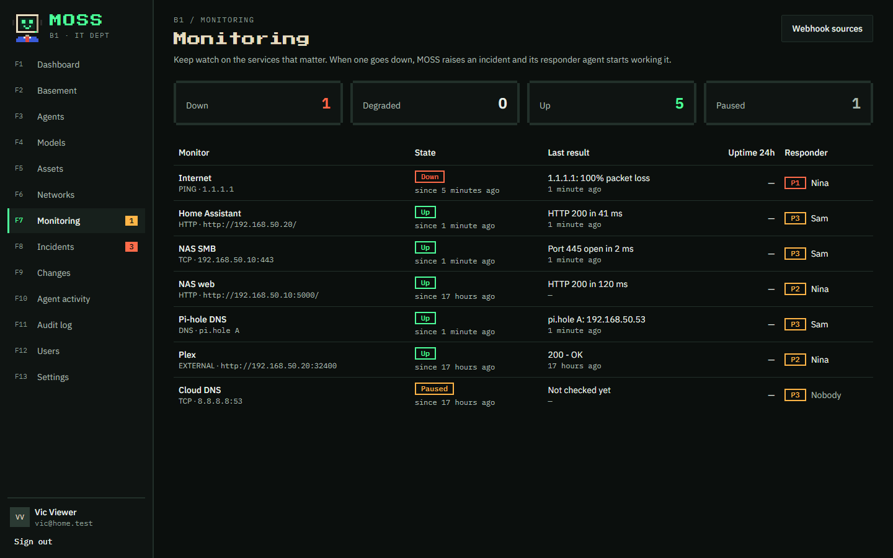
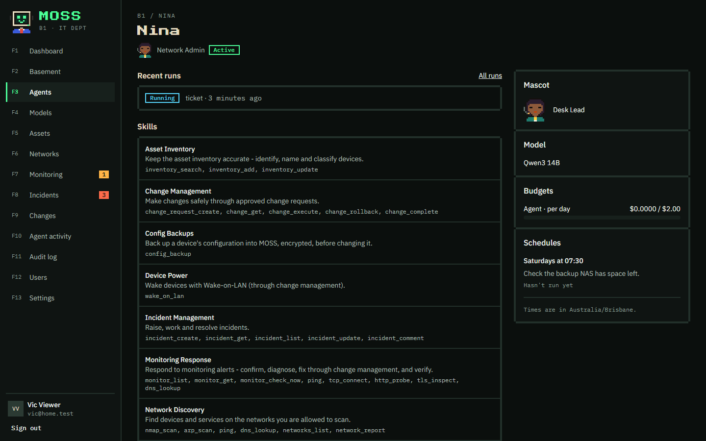
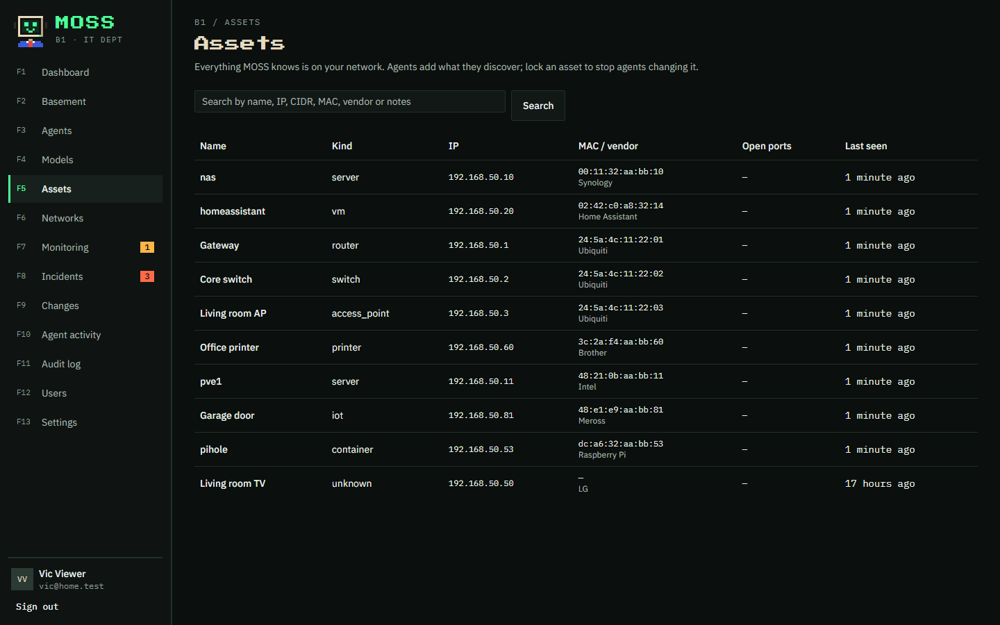
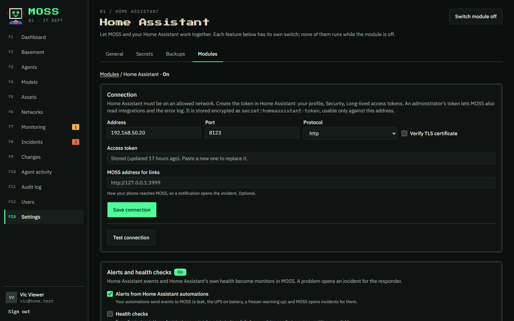

# MOSS — Managed Operations & Systems Service

**Your AI IT department.**

MOSS is a self-hosted IT department for home and small networks, staffed by AI agents. You hire
agents such as a Network Admin or a Systems Admin. They discover and inventory your network,
watch your services, work incidents, and propose fixes through real change management. They work
inside the budgets, permissions and network boundaries you set, and every action they take is
audited.

> **Status: early release (v0.1).** MOSS works end to end, but it is young software: expect rough
> edges and breaking changes between releases. Only point it at networks you own or are authorised
> to manage.



<table>
  <tr>
    <td></td>
    <td></td>
  </tr>
  <tr>
    <td></td>
    <td></td>
  </tr>
</table>

## What it does

- **Agents you hire, with budgets.** Start from a template (IT Manager, Systems Admin, Network
  Admin, Security Admin) or build your own from the skills you choose.
  - Each agent has a role, skills, schedules and a daily or monthly spending limit. Token use is
    metered exactly, and a hard limit pauses the agent.
  - **Chat** with any agent, or give it a task. Each agent's page suggests tasks that fit its skills
    and what's going on right now.
  - The **Tool access** page shows which agent can use which tool, and lets you grant or remove a
    tool for one agent.
  - Agents share a **knowledge base** and team memory, so what one learns about your network the
    others can find.
- **Bring your own model.** Supports Anthropic, OpenAI, OpenRouter, Ollama and any
  OpenAI-compatible endpoint. A local model through Ollama keeps everything on your network.
  Agents can also run on a **Claude Pro or Max subscription** instead of an API key (see below).
- **Discovery and inventory.** Agents scan the networks you allow (nmap, ARP) and keep an asset
  inventory. They can also read your **UniFi** controller's clients, query devices over **SNMP**,
  trace routes and look up names. You can lock an asset so agents can't change it.
- **Home lab integrations.** Agents check servers over SSH (disks, services, containers) and read
  **Proxmox**, **TrueNAS**, **Synology**, **Pi-hole**, **AdGuard Home** and **Home Assistant**
  through their own APIs. Credentials are stored as scoped secrets.
- **Incidents and change management.** Agents raise and work break/fix and security incidents.
  - Anything that changes a system goes through a change request listing the exact tool calls it
    will make, with a rollback plan.
  - Normal changes wait for a human to approve them. Pre-approved standard changes can run straight away.
  - Changes agents can make this way include restarting a service or container, rebooting a server,
    power-cycling a smart plug, Pi-hole and AdGuard rules and local DNS, and UniFi client blocks,
    DHCP reservations and Wi-Fi networks.
  - Agents can back up a device's configuration before they change it. Backups are stored encrypted
    and only people you allow can download them.
- **Monitoring.** Built-in ping, TCP, HTTP(S), TLS-expiry and DNS checks. MOSS also accepts
  alerts from **Uptime Kuma**, **Beszel**, **Prometheus Alertmanager** or any script that can
  post JSON.
  - When something goes down, MOSS opens an incident and its responder agent starts working it.
  - When it recovers, the incident is updated.
- **A Home Assistant module** for incidents from your automations, phone notifications, MOSS's
  status as sensors, an internet self-heal and more (see [below](#home-assistant)).
- **Your own tools.** Describe an HTTP API as a definition and agents can use it, with the same
  checks as built-in tools (see [Custom tools](#custom-tools)).
- **Web UI.** Dashboard with a getting-started checklist, agents, models, assets, networks,
  monitoring, incidents, changes, users and roles, settings, and a verifiable audit log. Sign-in
  supports two-factor authentication (TOTP).
  - **The Basement** shows your agents at their desks: who is working, who is on a break, and an
    alarm when a monitor is down. Every agent has a pixel-art mascot you can change.
  - Animations follow your device's reduced-motion setting, or your own choice in Settings.
- **Kill switch.** One switch pauses every agent immediately.

## How it keeps you safe

MOSS assumes the AI can be wrong and that your network can contain hostile data. A device named
"ignore previous instructions" is a real attack. Enforcement never depends on the model behaving.

- **No shell.** Agents only call typed tools with validated arguments (scan this subnet, probe this
  port). No tool runs arbitrary commands.
- **Every tool call goes through a policy gate**, which checks it against recorded state:
  - the kill switch, the agent's status and budget, and its tool grants;
  - network scope: networks you have **allowed** are permitted, **off-limits** networks are always
    refused, and networks you haven't decided on are refused by default;
  - any call that changes state must exactly match a change request a human approved, inside its
    time window.
- **Secrets never reach the model.** Credentials are encrypted at rest (AES-256-GCM, envelope
  encryption) and agents only see handles like `secret:router-ssh`. Only the gate can decrypt them,
  and only for the hosts and tools each secret is scoped to. Outputs are scrubbed of secret values.
- **Least privilege between services.** The worker, where the model's output lives, holds no
  secrets and can't reach the network tools directly. The toolbox runs read-only, as a non-root
  user, with only the network capabilities its scanners need.
- **Untrusted data stays data.** Scan results, banners, hostnames and webhook payloads are cleaned
  and passed to agents as data, never as instructions.
- **Hash-chained audit log.** Every human and agent action is recorded, and you can verify that
  the log hasn't been altered.

## Quick start

You need Docker with the Compose plugin and `openssl`. A Linux host is recommended. MOSS is
developed and tested on x86-64; ARM boards such as the Raspberry Pi 5 are a target but not yet tested.

```sh
git clone https://github.com/Dan5672/MOSS.git
cd MOSS
git checkout "$(git tag --list 'v*' --sort=-v:refname | head -n 1)"   # the newest release
sh deploy/init.sh   # creates deploy/.env, the master key and service tokens
docker compose -f deploy/docker-compose.yml --env-file deploy/.env up -d --build
```

Open http://localhost:3000 and follow the setup screen to create the owner account. Then:

1. **Networks**: add your LAN (for example `192.168.1.0/24`) and mark it **allowed**.
2. **Models**: add a provider (an API key, or a local Ollama URL) and a model.
3. **Agents**: hire a Network Admin and let it discover your network.
4. **Monitoring**: add checks for the services you care about, and choose an agent to respond.

**Back up `deploy/secrets/master.key`.** Without it, stored secrets can't be decrypted, even from a
database backup.

### Reaching MOSS from other devices

By default the web UI only listens on `127.0.0.1`. To use it from elsewhere on your network, set
`MOSS_WEB_BIND=0.0.0.0` in `deploy/.env`. Put it behind an HTTPS reverse proxy, and set
`MOSS_SECURE_COOKIES=true` once you do. Monitoring tools on other machines that send webhooks
need to reach it too.

### Discovery on your LAN

Scans run from the toolbox container. Scanning by IP (nmap) works across Docker's network; ARP
discovery only sees networks the container is attached to. Host networking for full LAN
discovery is planned.

## Monitoring

**Monitoring → Add a monitor** creates built-in checks. They run through the same policy gate as
agents, so they can only reach allowed networks. MOSS warns you if a target is outside them.

To connect tools you already run, go to **Monitoring → Webhook sources**. Each source gets its own
URL and token, and the page shows setup steps for Uptime Kuma, Beszel, Alertmanager and plain
JSON. Each alert becomes a monitor in MOSS.

When a monitor goes down, after a configurable number of failed checks:

- MOSS opens an incident at the priority you chose and assigns it to the monitor's responder.
  An agent responder starts investigating straight away.
- If it goes down again while that incident is open, MOSS adds a comment instead of opening another.
- When it recovers, the incident is updated, or resolved automatically if you prefer.
- Outages during an approved change on the same asset (a planned restart, for example) don't open
  incidents.

## Home Assistant

**Settings → Modules → Home Assistant** connects MOSS to your Home Assistant. Give it Home
Assistant's IP address (on an allowed network) and a long-lived access token, then use **Test
connection**. An administrator's token also lets MOSS read integrations and the error log. Each
feature has its own switch:

| Feature | What it does |
| --- | --- |
| Alerts | Your automations send events to MOSS through a `rest_command` (the page gives you one to paste). Each becomes a monitor, and a problem opens an incident for the responder you choose. |
| Health checks | Every 5 minutes: is Home Assistant answering, have integrations failed, are updates pending, are many entities unavailable. |
| Phone notifications | New incidents at or above a priority you choose go to the companion app, with a link to the incident. |
| Status sensors | `sensor.moss_open_incidents`, `sensor.moss_monitors_down`, `sensor.moss_changes_pending` and `binary_sensor.moss_agents_paused`, for dashboards and automations. |
| Inventory sync | Daily, or on demand: Home Assistant's device names, rooms, makers and models fill in your assets, matched by MAC or IP. Names you gave assets, and locked assets, are kept. |
| Internet self-heal | When your internet monitor has been down for a few minutes, an agent power-cycles the modem's smart plug through a pre-approved change, then checks the connection came back. At most once per incident. |
| Log review | Every day an agent reads Home Assistant's error log, compares it with what is normal for your home, and raises incidents for anything new or getting worse. |



While the module is off, none of this runs and agents can't use any Home Assistant tool. The token
is stored encrypted and can only be used against the address you gave. Apart from notifications and
its own `moss_*` sensors, anything MOSS changes in your home still goes through change management.

## Custom tools

You can give agents your own HTTP tools under **Agents → Custom tools**. A custom tool is a definition,
not code: typed parameters, one request template, an optional stored secret, and an optional filter
on the JSON result.

```yaml
key: plex_sessions
description: Active Plex streams on a media server
class: read                     # read tools use GET; anything that changes state is "write"
params:
  host: { type: ip, target: true }
secret: plex-token              # stored under Settings → Secrets
request:
  method: GET
  scheme: http
  port: 32400
  path: /status/sessions
  headers: { X-Plex-Token: "{{secret}}", Accept: application/json }
result:
  pick: $.MediaContainer.Metadata[*].title
```

Custom tools follow the same rules as built-in ones:

- Requests only go to the target IP, which must be inside an allowed network. A hostname can only be
  sent as the Host header.
- Write tools need an approved change request for each call.
- The gate fills in `{{secret}}` only if the agent was granted the secret and the host and tool are
  within its scope. The secret never goes in the URL path, and it is removed from results and the
  audit log.
- Parameter values are encoded for where they land, and line breaks in headers are refused.
  Responses are size- and time-limited and returned to the agent as untrusted data.

## Using a Claude subscription

Agents can run on your Claude Pro or Max plan instead of an API key. MOSS drives them through the
Claude Code CLI, locked down so it is only a model loop:

- All of Claude Code's built-in tools are removed (shell, files, web), and user and project
  settings are ignored. The agent's only tools are MOSS's, so every network action still goes
  through the policy gate.
- MOSS refuses the run if Claude Code ever reports a tool that isn't one of MOSS's.
- The subscription token is stored encrypted in the gate and added to requests there. It never
  reaches the worker where the agent runs.

To set it up, run `claude setup-token` on any computer with Claude Code, then go to **Models** in
MOSS. Add a provider of type **Claude subscription**, paste the token, and add a model such as
`claude-sonnet-5-5`. Give these agents token budgets, since subscription use has no per-token price.

Runs count against your plan's usage limits, and runs fail until a limit resets. Using a personal
plan this way is your decision under Anthropic's terms for that plan. For guaranteed capacity, use
an API key.

## Backups and upgrades

Your data lives in a Docker volume (`pgdata`), `deploy/secrets/` and `deploy/.env`. The containers
hold no state, so upgrades happen in place without reconfiguring anything.

```sh
sh deploy/backup.sh                          # database + secrets + settings -> deploy/backups/
sh deploy/upgrade.sh                         # back up, move to the newest release, rebuild, migrate, health-check
sh deploy/upgrade.sh v0.2.0                  # or a specific release
sh deploy/upgrade.sh --rollback              # go back to the version before the last upgrade
sh deploy/restore.sh <backup> [--checkout]   # restore a backup (and, with --checkout, the code it came from)
```

- The new version is built while the old one keeps running, so a failed build changes nothing.
  Database migrations run in a single transaction, so a failed migration leaves your data as it was.
- `--rollback` reuses the previous images, so it needs no rebuild. It restores the pre-upgrade
  backup only if the upgrade changed the database. In that case anything recorded since the
  upgrade is lost, and the script warns you first.
- Backups include the master key. They are written owner-only, and the newest 10 are kept
  (`MOSS_BACKUP_KEEP`). Copy them off the machine.
- **Moving to a new machine:** clone MOSS, run `sh deploy/restore.sh <backup>`, then
  `sh deploy/init.sh`.

## Roadmap

- **Next:** passive discovery, LLDP and a network topology map, OPNsense and pfSense, email and
  push notifications beyond Home Assistant, and host networking for full LAN discovery.
- **Later:** a development board for the Developer agent, a public integration SDK, and external
  MCP tool packs.

## Architecture

```
web       Next.js UI and server actions
worker    agent runtime, schedules, event handling, monitor scheduling
gate      policy gate + secrets broker: the only service with the master key and the only path to the toolbox
toolbox   typed network tools (nmap, arp-scan, ping, DNS, probes, SNMP, SSH checks, device APIs), no shell
postgres  PostgreSQL 17 + pgvector, plus the job queue (pg-boss)
```

It is a TypeScript monorepo (pnpm + Turborepo): `apps/` holds the services above. `packages/`
holds shared code: db, core domain logic, policy, tools, llm and the agent runtime. `library/`
holds the agent templates and skills, written as plain YAML and Markdown.

## Development

```sh
corepack enable                         # provides pnpm
sh deploy/init.sh
docker compose -f deploy/docker-compose.yml --env-file deploy/.env up -d --build
pnpm install && pnpm -r run build
```

Unit tests always run. Database integration tests run when `MOSS_TEST_DATABASE_URL` points at a
Postgres server; each suite creates its own database.

```sh
MOSS_TEST_DATABASE_URL=postgres://moss:<password>@localhost:5432/moss_test pnpm -r run test
cd apps/web && MOSS_TEST_DATABASE_URL=... pnpm exec playwright test   # browser end-to-end tests
```

### Lab network

`deploy/lab/compose.lab.yml` adds a safe test environment: an allowed subnet (`172.30.10.0/24`)
and an off-limits subnet (`172.30.66.0/24`), each with target containers, plus a scripted model so
no API key is needed.

```sh
docker compose -f deploy/docker-compose.yml -f deploy/lab/compose.lab.yml --env-file deploy/.env up -d --build
DATABASE_URL=postgres://moss:<password>@localhost:5432/moss node apps/worker/dist/scripts/seed-lab.js
```

Scans and monitors of `172.30.10.0/24` run. Anything touching `172.30.66.0/24` is refused by the gate.

## Contributing

Issues and pull requests are welcome. For anything larger than a small fix, please open an issue
first to discuss it. Contributions require signing a Contributor License Agreement, because MOSS
is offered under both an open-source and a commercial license.

Please report security problems privately rather than in a public issue.

## License

MOSS is open core under the [GNU AGPL v3.0](LICENSE). A commercial license is available for
business features.
